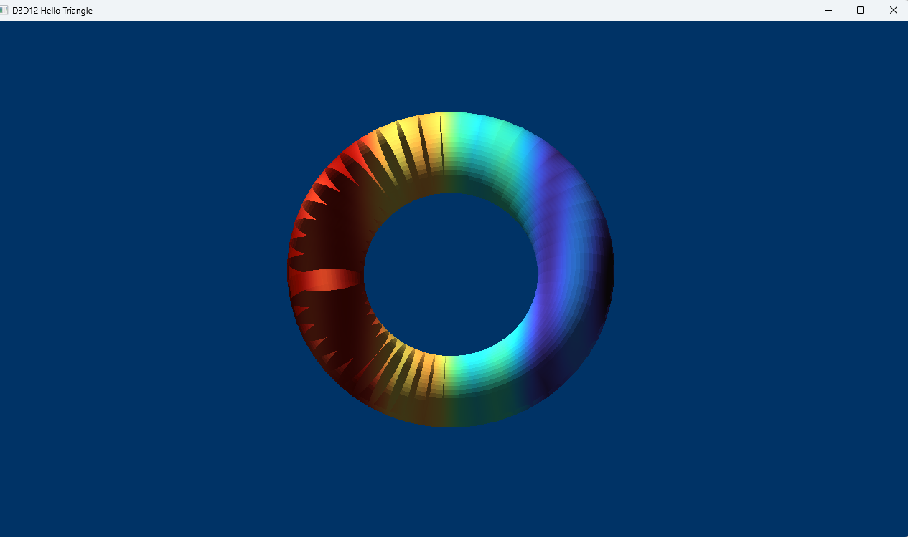

# Direct3D 12 : Torrus rendering 

Problem A — Scientific Field Visualizer on a Triangle Mesh
Background

## Hello, torrus! sample

I have taken the standard Samples from the DirectX12 and built the solution on top of it . I could reuse the render pipeline infrastructure required for rendering .
I have tried to implement the Level 1 implementation tasks which include 
 
 Load a triangle mesh — Parse a mesh format of your choice (OBJ, PLY) :- I used a sample torus obj file 
 Per-vertex scalar field visualization — Each vertex carries a scalar value.: - I used the Viridis colormaps
 Orbital camera — Mouse drag to orbit, scroll to zoom, right-click to pan. The mesh should remain centered at all times :- I have implemented 2 functions ...using left mouse button we can orbit and using right mouse we can pan . Although there is a 
                    bug in the pan logic which I could have handled it in the WndProc mouse key events better . I did not implement the zoom in zoom out on the scroll due to time constraints 
 Lighting — At minimum, Lambertian diffuse shading with a hardcoded light direction. :- The OBJ model did not contain precomputed vertex normals (vn). Therefore, smooth vertex normals were generated by computing the face normal of each triangle using 
                                                                                        the cross product of its edges and accumulating these normals at each vertex. 
																						The accumulated vectors were then normalized to produce per-vertex normals suitable for smooth shading. This approach approximates the continuous surface normals 
																						of the torus and enables proper Lambertian lighting.                                                                                                                         
Build Steps:-

1) Download or clone the repository 
2) Build & Run D3D12HelloWorld\src\D3D12HelloWorld.sln 

